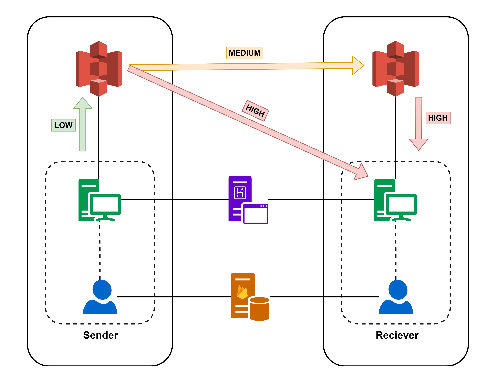

# EdgeAware

EdgeAware is a virtual edge-network service that permits peer-to-peer data transfer between individual nodes and employs a sophisticated decision-making algorithm to determine if data in the cloud should be available at the edge.

### About the Project



A user having a storage bucket in a certain region can connect to the service to send and receive data. Using a machine-learning algorithm, the priority of the data is predicted and then transmitted asynchronously to the edge of other users in different locations so that it is easily available to them, at their edge.

Data is categorised according to priority as follows:

- **High** : Data will be available in the sender's bucket, the receiver's bucket, and the receiver's local computer.
- **Medium** : Data will be available in both the sender's and receiver's buckets.
- **Low** : Data will only be available in the sender's bucket.

## Commands

**Register** - Register a user and configure account and bucket information

```
register
```

**Login** - Sign in to use the service, and send or receive files

```
login <username> <password>
```

**Reset Password** - Get the password reset link to your email

```
reset_password <email>
```

**Send** - Send a file to a user with predicted priority (or with optional provided priority)

```
send <to_username> <filepath> [<priority>]
```

**Check** - Check sent or received tracked files, along with their priority and sync status

```
check
```

**Sync** - Sync all files (or a specific file) according to their priority automatically

```
sync [<file_id>]
```

**Delete** - Delete a file from all tracked buckets

```
delete <file_id>
```

**Logout** - Logout and stop the service

```
logout
```

Utility commands such as `record` and `playback` can be use to save and execute commands from a file.

## Technologies used

- [Amazon S3](https://aws.amazon.com/s3/) ‒ Cloud storage service
- [Firebase](https://firebase.google.com/) ‒ User authentication and file commits
- [Boto3](https://boto3.readthedocs.io) ‒ Low-level API to access to AWS services
- [Scikit-learn](https://scikit-learn.org/) ‒ Machine learning algorithm
- [Heroku](https://www.heroku.com/) ‒ Cloud platform to deploy service worker

## Local setup

- Clone this repository

```
git clone https://github.com/aravrs/EdgeAware.git
cd EdgeAware
```

- Install requirements

```
pip install -r requirements.txt
```

- Setup credentials

  - Add firebase app config credentials to [`config.json`](config.json) file.
  - Setup up and run the service worker file, [`worker/tansfer.py`](worker/transfer.py) on any cloud platform (we used [heroku](https://www.heroku.com)) or run it locally.

- Start the EdgeAware CLI to execute commands

```
python cli.py
```
